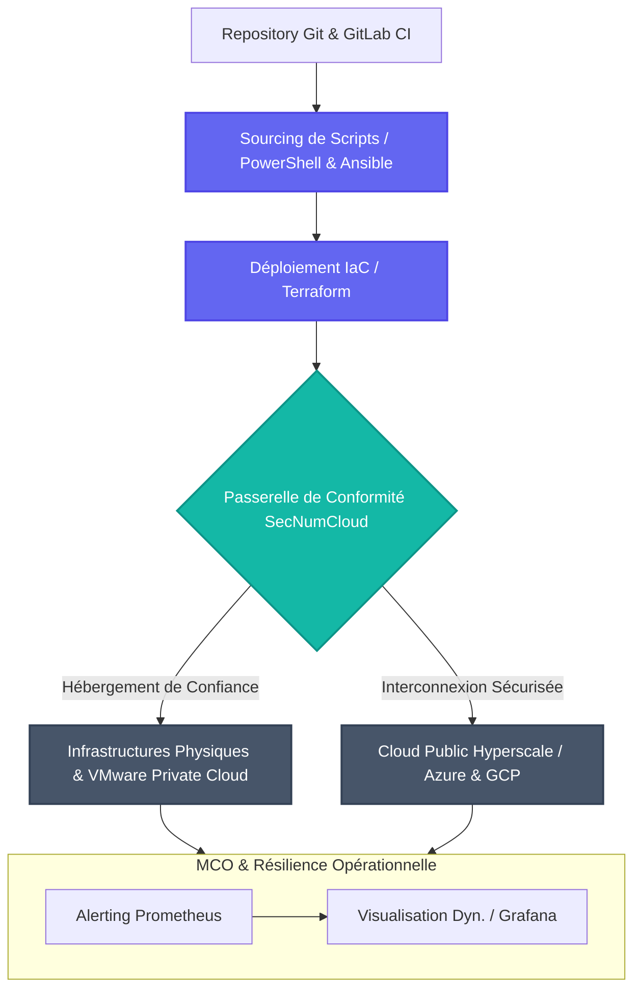
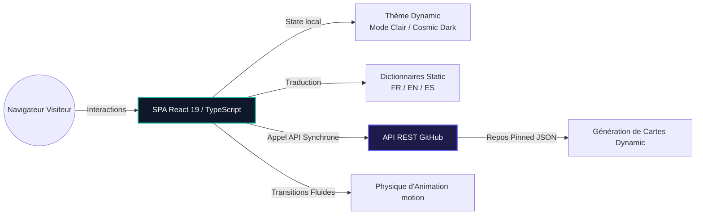

# 💻 Portfolio de Melvin Cureau - SysOps & Cloud Engineer

<p align="center">
  <a href="https://img.shields.io/badge/React-20232A?style=for-the-badge&logo=react&logoColor=61DAFB"></a>
  <a href="https://img.shields.io/badge/TypeScript-007ACC?style=for-the-badge&logo=typescript&logoColor=white"></a>
  <a href="https://img.shields.io/badge/Vite-646CFF?style=for-the-badge&logo=vite&logoColor=FFD62E"></a>
  <a href="https://img.shields.io/badge/Tailwind_CSS-38B2AC?style=for-the-badge&logo=tailwind-css&logoColor=white"></a>
  <a href="https://img.shields.io/badge/Framer_Motion-black?style=for-the-badge&logo=framer&logoColor=14b8a6"></a>
</p>

<p align="center">
  
  
  
</p>

---

## 🌟 Présentation Générale

Bienvenue sur le dépôt public du portfolio professionnel de **Melvin Cureau**, futur ingénieur spécialisé en **Ingénierie SysOps & Architectures Cloud**.

Actuellement en Master d'ingénierie à **SUPINFO Tours**, Melvin consolide une expertise pragmatique de la maintenance en conditions opérationnelles (MCO), de l'automatisation avancée et de l'orchestration à travers ses expériences immersives au sein de **Cloud Temple**, hébergeur Cloud souverain français qualifié par l'ANSSI (**SecNumCloud**).

Ce projet héberge le code complet de son site portfolio interactif : moderne, fluide, accessible (conformité aux standards WCAG), traduisible en temps réels en trois langues (**Français**, **Anglais**, **Espagnol**), doté d'un commutateur de thèmes (sombre/clair) et entièrement synchronisé avec l'API GitHub pour exposer ses réalisations à jour.

---

## ☁️ Focus Entreprise & Stage : Cloud Temple (Qualification SecNumCloud)

**Cloud Temple** est l'un des acteurs majeurs du cloud de confiance en France, certifié par l'ANSSI. Intervenir dans ces infrastructures implique de relever des défis techniques de haut niveau :

### Rôles occupés par Melvin chez Cloud Temple :
* **Ingénieur SysOps (Alternance - Depuis Sept. 2025)** : Industrialisation de processus sysops d'envergure via PowerShell et Terraform, administration d'architectures VMware hautement disponibles, et application intransigeante des normes strictes SecNumCloud et PAMS (Privileged Access Management).
* **Ingénieur de Production (Alternance - Oct. 2024 à Sept. 2025)** : Résolution d'incidents N2/N3 en conditions de haute criticité sous contrats de SLA exigeants (GTI/GTR), participation active à l'élaboration de documents d'architecture (DAT, DEX) pour l'intégration de SI clients d'envergure.
* **Ingénieur de Production (Stage - Juil. 2024 à Sept. 24)** : Analyse préventive d'alertes via des scripts en Python et Bash, et traitement d'incidents serveurs sur architectures virtualisées complexes.

<p align="center">
  
  
  
  
  
  
</p>

---

## 📊 Schémas d'Architecture & de Flux

Pour illustrer à la fois mes domaines d'intervention Cloud d'une part, et le fonctionnement interne de ce portfolio d'autre part, voici deux schémas explicites :

### 1. Pipeline SysOps, Automatisation & Supervision (Savoir-faire Technique)

Ce schéma décrit comment s'articulent mes projets d'infrastructure : de l'écriture des scripts d'IaC jusqu'à leur supervision en production sous contraintes de gouvernance forte.



### 2. Architecture Applicative du Portfolio

Ce schéma montre le fonctionnement réactif de ce site web, s'appuyant sur les modules modernes de React, Tailwind CSS et motion, couplés avec l'API REST de GitHub.



---

## 🚀 Fonctionnalités Majeures du Portfolio

1. **Traduction Instantanée In-App** : Changement dynamique à la volée entre FR, EN et ES avec conservation optimale de l'UX.
2. **Double Système de Thème** : Mode sombre soigné (*Cosmic Dark*) pour l'identité d'ingénierie système, et mode alternatif clair contrasté.
3. **Synchronisation API Live** : Requêtes asynchrones fiables pour récupérer les dépôts épinglés sous forme de composants interactifs.
4. **Parcours Modulaire & Accordéons Intelligents** : Permet une vision condensée immédiate (idéale pour les chargés de recrutement) extensible pour un examen approfondi du CV.
5. **Formulaire de Contact Intégré** : Interface soignée avec simulation de transfert et sécurité anti-abus locale.

---

## 🛠️ Stack Technique de l'Application

* **React 19 & TypeScript 5** : Robustesse de typage strict des structures d'interfaces.
* **Vite** : Bundleur ultra-rapide garantissant des scores de chargement Web exceptionnels.
* **Tailwind CSS v4** : Styling moderne natif, hautement optimisé et hautement réactif.
* **motion** : Transitions fluides et réactivité physique aux survols et lancements.
* **Lucide React** : Icônes vectorielles légères et modernes.

---

## 📂 Structure Tracée du Projet

```bash
.
├── metadata.json       # Métadonnées d'identification du portfolio
├── package.json        # Manifeste npm (dépendances standardisées)
├── tsconfig.json       # Configuration stricte du compilateur TypeScript
├── vite.config.ts      # Configuration optimisée du bundleur Vite
├── index.html          # Point d'entrée avec balises méta SEO complètes
├── README.md           # Ce guide technique et professionnel
└── src
    ├── main.tsx        # Point d'ancrage React au DOM virtuel
    ├── index.css       # Intégration globale de la couche Tailwind CSS v4
    ├── types.ts        # Interfaces et signatures de types strictes
    ├── translations.ts # Dictionnaires multilingues (FR / EN / ES)
    └── App.tsx         # Dashboard interactif et logique d'animation globale
```

---

## ⚙️ Installation & Démarrage Local

Pour cloner et exécuter le projet dans votre environnement de test local :

### 1. Prérequis
Vous devez disposer de [Node.js](https://nodejs.org/) (version 18 ou supérieure recommandée) et d'`npm` ou `yarn`.

### 2. Cloner et Installer les Dépendances
```bash
git clone https://github.com/votre_profil/portfolio-melvin.git
cd portfolio-melvin
npm install
```

### 3. Lancer en Mode Développement
```bash
npm run dev
```
Accédez au site en local à l'adresse suivante : [http://localhost:3000](http://localhost:3000).

### 4. Compiler pour la Production
Pour auditer ou générer le code buildé et minifié à déployer :
```bash
npm run build
```
Les fichiers d'exploitation optimisés seront générés au sein du répertoire `/dist`.

---

## 🔒 Résolution du Filtrage Réseau (ex: Sophos Web Protection)

Ce site web dispose de toutes les méta-informations utiles (Dublin Core, OpenGraph complet, tags Schema.org Person JSON-LD) pour une indexation claire et professionnelle.

Si certaines passerelles de sécurité d'entreprises (comme **Sophos Web Protection**) bloquent le domaine car récemment enregistré ("Sans catégorie" ou "Uncategorized") :

1. Visitez le [Portail de Soumission Sophos Labs](https://support.sophos.com/) ou [FortiGuard Web Filter Request](https://www.fortiguard.com/faq/wrating).
2. Soumettez l'adresse `https://melvincureau.com/`.
3. Suggérez les étiquettes de classification officielles : **"Personal / Portfolio"**, **"Information Technology"**, ou **"Business"**.
4. La réévaluation de réputation se propage sur les firewalls client sous 24h.

---

## 📬 Me Contacter

N'hésitez pas à me joindre pour des opportunités professionnelles, d'ingénierie ou un échange technologique :

* **📬 Email Professionnel** : `portfolio@melvincureau.com`
* **💼 LinkedIn** : [Melvin Cureau](https://www.linkedin.com/in/melvin-cureau-83a812252/)
* **💻 GitHub** : [melvincr1](https://github.com/melvincr1) (ou le profil public associé)

---

*Développé avec rigueur et passion pour l'excellence opérationnelle et la culture SysOps.*
